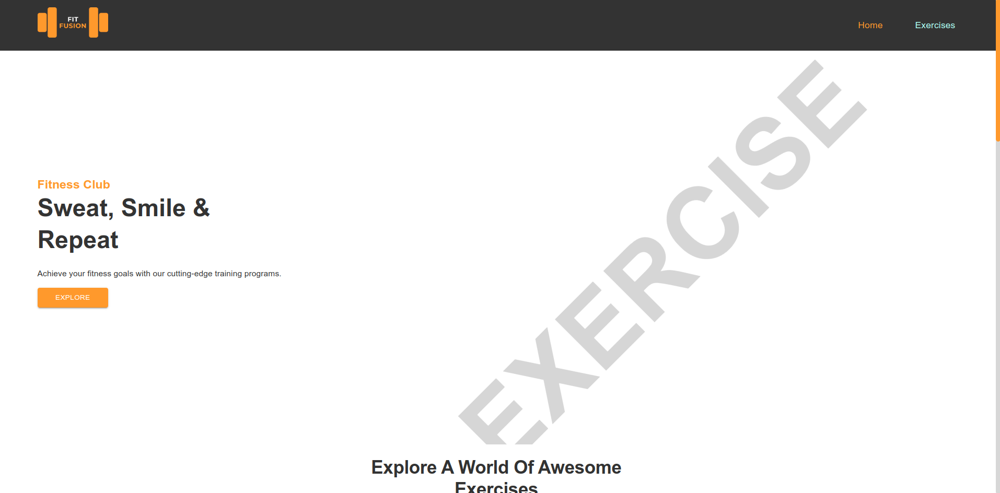

# FIT FUSION

The FitFusion website is a comprehensive platform designed to empower individuals on their fitness journey. It offers a wide range of cutting-edge training programs, expert guidance, and a supportive community to help users achieve their fitness goals. FitFusion integrates innovative technology, personalized fitness plans, and a thriving community to create a holistic fitness experience.

FitFusion is for fitness enthusiasts of all levels, from beginners looking to kickstart their fitness journey to seasoned athletes seeking new challenges. It caters to individuals who value innovation, expert guidance, and a supportive community in their pursuit of optimal fitness. FitFusion's diverse training programs and personalized fitness plans cater to a wide range of goals, including weight loss, muscle gain, flexibility, and overall wellness. Whether users prefer home workouts or gym sessions, FitFusion provides the resources, expertise, and community support to help them succeed.

## Demo

[Fit-Fusion Demo](https://fit-fusion-transform.netlify.app/)

[](https://fit-fusion-transform.netlify.app/)

<br>

## Color Reference

| Color            | Hex                                                              |
| ---------------- | ---------------------------------------------------------------- |
| Background Color |  #ffffff |
| Text Color       |  #333333 |
| Accent Color     |  #F09742 |

<br >

## Installation of Vite

```bash
  npm create vite@latest

  cd my-project

  npm install

  npm run dev
```

<br>

## Run Locally

Clone the project

```bash
  git clone https://link-to-project
```

Go to the project directory

```bash
  cd my-project
```

Install dependencies

```bash
  npm install
```

Start the server

```bash
  npm run dev
```

## 🔗 Links

[](https://webfoliohash.netlify.app/)
[](https://www.linkedin.com/in/satya-surendra/)
